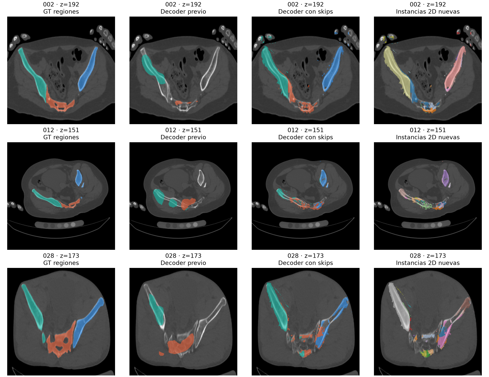

# Adaptación de Sesión 2 a PENGWIN — semana 10

Referencia proporcionada por el usuario: `Segmentacion_Sesion2_UNetPP_MaskRCNN_YOLO_SAM_Completo .ipynb`. Se adaptan conceptos del curso; no se ejecutaron sus descargas ni experimentos de mascotas y peatones.

## Implementación

- Se conserva FundidoraPC con cuatro etapas residuales y CBAM9, detección grid, NMS propio y clasificación de presencia.
- El decoder recibe características de tres escalas del encoder y de la imagen de entrada. Las proyecciones convierten 128/64/32/3 canales a ocho; después se suman, sin concatenación. Todos los bloques de reconstrucción operan con ocho canales.
- Se añaden tres salidas semánticas auxiliares durante entrenamiento (supervisión profunda). La inferencia usa solo la salida final.
- Los IDs GT se convierten en máscaras individuales, clase anatómica e interiores normalizados por fragmento. Los interiores y las interfaces son objetivos invariantes a renumerar los IDs locales. El interior normalizado es un objetivo 2D en píxeles, no la distancia física entre fragmentos.
- La reconstrucción volumétrica emplea watershed, semillas de interior > 0,5 y borde < 0,5, vecindad 26 y mínimo predicho de 20 mm³. El mínimo no elimina anotaciones GT. Cada instancia conserva la región anatómica.

Esta es una adaptación ligera inspirada en U-Net/U-Net++, no una U-Net++ completa. Los objetivos auxiliares ayudan a representar fragmentos, pero no garantizan separación perfecta. Los parámetros del posprocesamiento aún requieren calibración en validación.

## Protocolo ejecutado

Ambas variantes: entrenamiento desde cero, seis épocas, semilla 42, lote 8 y CPU. Se usan ocho cortes uniformes por paciente: 560 cortes de 70 pacientes train y 120 de 15 val. Se mantiene el split congelado. Se incluyen cortes sin hueso. No se entrenó con imágenes sintéticas.

La comparación es contra el experimento previo de revisión, que usa el decoder sin skips y ya incluye la salida de bordes. No se compara directamente contra el overfit de cuatro cortes del caso 001. Se selecciona cada checkpoint por la media de mAP50 y Dice semántico en val.

Checkpoints seleccionados: previo, época 5; adaptación, época 6. SHA-256 en `salidas/sesion2/comparacion_val.json`.

| Métrica de validación | Decoder sin skips | Adaptación Sesión 2 |
|---|---:|---:|
| mAP50 | 44.82 % | 52.63 % |
| mAP50:95 | 13.60 % | 14.28 % |
| F1 de presencia | 77.22 % | 90.11 % |
| Dice semántico macro | 27.14 % | 48.80 % |
| Dice por instancia GT 2D (omisiones incluidas) | 14.80 % | 39.25 % |
| Dice simétrico por instancia 2D (incluye extras) | 9.36 % | 1.83 % |

| Dice por región | Sin skips | Sesión 2 |
|---|---:|---:|
| Sacro | 38.82 % | 23.95 % |
| Coxal izquierdo | 0.00 % | 61.66 % |
| Coxal derecho | 42.59 % | 60.79 % |

Instancias GT en los cortes: 272. Omisiones previo/nuevo: 163/22. Predicciones adicionales previo/nuevo: 158/5573.

Los IDs se emparejan 1:1 por IoU dentro de la misma región. La métrica simétrica penaliza también instancias adicionales. Son mediciones 2D; no confundirlas con fragmentos volumétricos.

## Pérdidas y atribución de la mejora

Se conserva detección y se añade 1,2 × [CE + 1,5 Dice + 0,5 BCE de interfaces + 0,5 MSE de interiores + 0,3 CE auxiliar]. CE pesa fondo 0,2 y cada hueso 1; las interfaces positivas y los interiores negativos se promedian por separado. La MSE de interiores equilibra hueso/fondo. Las salidas auxiliares se supervisan con etiquetas remuestreadas por vecino más cercano.

El experimento cambia conjuntamente skips, supervisión profunda y objetivo de interiores. No permite atribuir el resultado a un único componente ni sustituye la calibración de pesos o la ablación con/sin CBAM exigida para el informe final.

## Inferencia 3D real

Caso 002 de validación: 337 cortes contiguos. 6 fragmentos GT remuestreados y 1620 instancias predichas. Dice macro por fragmento GT: 29.02 %; Dice simétrico: 0.11 %. Omisiones: 0; adicionales: 1614.

Parejas válidas para distancia: 0. MAE en mm: no calculable por falta de correspondencias válidas.

El principal GT se identifica por 1/11/21; el principal predicho es el de mayor volumen del mismo hueso. Se exige IoU ≥ 0,5 para fragmento y principal. EDT aproxima distancias entre centros de vóxeles de superficie; el contacto26 se informa por separado. XY se reduce a 256 ajustando espaciado y origen. Remuestrear GT puede perder fragmentos pequeños; falta evaluación a resolución nativa.

### Control del exceso de instancias

En el mismo caso val 002 se ensayó un mínimo de 50 mm³ para las semillas (se mantiene mínimo de 20 mm³ para instancias predichas). Las instancias bajaron de 1.620 a 358, frente a 6 GT. Dice por fragmento GT: 34.75 %; simétrico: 0.58 %. Siguen existiendo 352 predicciones adicionales y 0 parejas válidas para distancia. Esto continúa siendo sobresegmentación importante; no es una solución validada.

La inferencia nueva usa este filtro de semillas por defecto. El resultado inicial permanece en volumenes/ y el filtrado en volumenes_filtrado/. Este ajuste se probó solo en un volumen val, no es una evaluación externa.

### Sensibilidad 2D en validación

Se compararon nueve combinaciones: semillas mínimas de 4/16/64 píxeles e instancias mínimas de 0/4/16 píxeles. La mejor por Dice simétrico fue 64/16: Dice GT 40.63 %, simétrico 9.68 %, 43 omisiones y 870 extras. Estas cifras corresponden al ajuste en val, no a test; no se trasladan automáticamente de píxeles 2D a mm³.

La tabla principal y la figura conservan las instancias 2D sin este filtrado para mostrar el problema inicial. Todos los candidatos están en calibracion_instancias_2d.json. Nunca se filtra GT.

**Regresión que debe corregirse:** el Dice del sacro bajó de 38,82 % a 23,95 %, aunque mejoraron ambos coxales y la media. La adaptación mejora la segmentación semántica global, pero todavía no resuelve la separación de fragmentos.

## Qué se mantiene pendiente

- Ampliar el entrenamiento y validar en más volúmenes completos, conservando la separación por paciente.
- Calibrar pérdidas y posprocesamiento en train/val, especialmente para fragmentos pequeños y superficies en contacto.
- Comparar la adaptación final con SAM tras congelarla. Los resultados SAM de `revision_oct08` corresponden al modelo anterior; no se trasladan a esta variante.
- La comparación de esta adaptación no abre test. Su test ya tuvo exposición exploratoria en versiones anteriores; será necesario declarar esa limitación.
- Medición GPU pendiente; entorno disponible CPU. La arquitectura y pruebas no constituyen validación clínica.

## Archivos de entrada

- `notebooks/Semana3_Sesion2_Fragmentos.ipynb`: inspección de objetivos reales, resultados y reproducción.
- `scripts/entrenar_sesion2.py`, `evaluar_sesion2.py` e `inferir_sesion2_3d.py`: ejecución reproducible.
- `salidas/sesion2/entrenamiento/`: configuración, historial y pesos best/last.
- `tests/test_sesion2.py`: gradientes en skips, límite de ocho canales, objetivos por instancia, invariancia a IDs y separación geométrica.

Las salidas anteriores del equipo se preservan y se respaldan antes de actualizar código. El notebook original del profesor permanece sin modificaciones. No se consultó ni actualizó Git.
