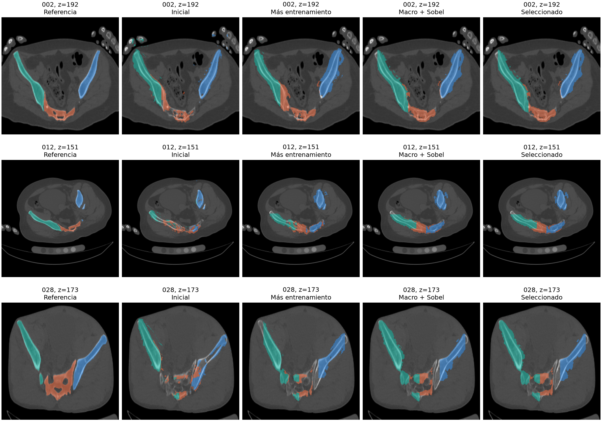

# Máscara macro, LPS, contornos y refinamiento

## Qué se aplicó

1. **Máscara macro mediante deep learning.** Se conserva FundidoraPC, CBAM9, decoder de ocho canales y skips. El modelo ya segmentaba fondo, sacro y ambos coxales. Se añade supervisión explícita de la unión de los huesos, con BCE equilibrada entre hueso y fondo más Dice; peso 0,5 dentro de la pérdida de segmentación. No sustituye la separación posterior de fragmentos.
2. **Sobel y contorno.** Gradientes Sobel diferenciables por clase anatómica comparan probabilidades predichas y máscara de referencia; peso 0,2. Se equilibran banda de borde y exterior. Es un término de entrenamiento: no se confunden todos los bordes de intensidad del CT con fracturas. La salida anterior de interfaces entre fragmentos y la de interiores se conservan.
3. **Vecindad de refinamiento.** Promedio bilateral local 3×3, ocho vecinos 2D, guiado por intensidad ventaneada; solo probabilidades con confianza menor de 0,80. Se comparan intensidades de refinamiento 0, 0,25 y 0,50 en validación, una iteración y sigma 0,10. Cero significa no aplicar. No se conserva únicamente el componente mayor ni se rellenan indiscriminadamente huecos. La reconstrucción volumétrica mantiene vecindad 26 y umbrales físicos, distintos de los parámetros 2D.
4. **LPS.** Ya existía; no se presenta como mejora nueva de precisión. Se añade validación de geometría finita, ejes ortogonales y spacing positivo. La auditoría de headers de los 100 pares CT/máscara dio alineación y geometría válidas: 66 originales LPS y 34 RAS (no RAI). Reorientar permuta/invierte ejes y actualiza origen/dirección; no cambia HU, IDs ni puntos físicos. No hace registro ni elimina la oblicuidad.
5. **Anomalías como control de calidad.** Se informan incertidumbre y componentes desconectados. En 3D, más de diez componentes de una región genera alerta para revisión. Es una heurística no calibrada clínicamente: un componente no equivale necesariamente a un fragmento y no se eliminan resultados por la alerta. No se entrenó un detector de enfermedades.

## Flujo implementado

CT → validar geometría → reorientar a LPS → ventana HU [−500, 1300] y escala [0,1] → red propia → probabilidades de fondo/sacro/coxales → refinamiento local seleccionado → restricción por cajas predichas → reconstrucción 3D con vecindad 26 → control de calidad → emparejamiento y distancias.

LPS normaliza la orientación, mientras que el ventaneo normaliza intensidades: son operaciones diferentes. Las máscaras de referencia solo se usan para entrenar o evaluar, no como entrada durante la inferencia. Sobel de las etiquetas supervisa el entrenamiento; en inferencia no se necesita la máscara del paciente.

## Comparación medida

Mismos 560 cortes de 70 pacientes train y 120 cortes de 15 pacientes val, resolución 256×256, sin nuevas evaluaciones test. Control y candidato parten del mismo checkpoint, mismo orden de datos y semilla 42, seis épocas adicionales, AdamW a 0,0001 y lote 8. La selección de checkpoint usa 0,75 × Dice macro + 0,25 × Dice de la peor región, igual para ambos. Las cajas predichas siguen restringiendo las máscaras.

| Experimento sin refinamiento | Dice macro | Sacro | Coxal izquierdo | Coxal derecho | mAP50 |
|---|---:|---:|---:|---:|---:|
| Checkpoint previo (6 épocas) | 48.80% | 23.95% | 61.66% | 60.79% | 52.63% |
| Control: 6 épocas adicionales | 59.45% | 48.87% | 63.02% | 66.46% | 58.78% |
| Macro + Sobel: 6 épocas adicionales | 60.45% | 52.68% | 63.01% | 65.65% | 63.82% |

Así se distingue entrenamiento adicional de la pérdida macro/Sobel. Este experimento evalúa ambos términos juntos, no demuestra el efecto causal individual de Sobel.

La selección final admite únicamente combinaciones que no reduzcan el Dice de ninguna región ni el mAP50 frente al checkpoint inicial; dentro de ellas maximiza el mismo criterio de Dice macro y peor región.

Selección en validación: **macro_sobel**, refinamiento **0.25**. Dice macro pasa de 60.45% sin refinamiento a **60.45%** con el ajuste seleccionado. No es un resultado independiente de test ni una garantía de mejora en otros pacientes. El archivo `comparacion.json` incluye las nueve combinaciones, las métricas sin restricción por cajas y F1 de contornos con tolerancia de dos píxeles a resolución 256 (no milímetros).

**El refinamiento tuvo una ganancia marginal**: 0.0063 puntos porcentuales de Dice macro. No demuestra por sí solo una mejora relevante y queda desactivable con intensidad cero mediante una nueva selección documentada.

**No todas las métricas mejoraron.** F1 de contornos, tolerancia de dos píxeles:

| Variante sin refinamiento | Sacro | Coxal izquierdo | Coxal derecho |
|---|---:|---:|---:|
| inicial | 23.71% | 57.49% | 42.94% |
| control | 42.66% | 42.07% | 43.38% |
| macro_sobel | 35.48% | 39.91% | 35.28% |

La variante macro/Sobel mejora Dice frente al control, pero su F1 de contornos es inferior en las tres regiones. Añadir una pérdida de contorno no garantiza que el contorno final sea más preciso. Persisten máscaras demasiado anchas y confusión entre huesos, visibles en la figura; hay que revisar balance de pérdidas y cobertura de entrenamiento. No se presenta como solución definitiva de los bordes.

Instancias 2D seleccionadas: 272 apariciones GT; 42 omitidas, 179 extras; Dice simétrico 29.47%. Se conservaron los umbrales anteriores de 64 píxeles de semilla y 16 de instancia. No son fragmentos 3D ni umbrales transferibles a mm³.

## Volumen completo y distancias

Caso 002 de validación, 337 cortes contiguos: Dice semántico 63.15%.

- Fragmentos GT: 6; instancias predichas: 96; extras: 92; omitidos: 2.
- Dice de fragmentos simétrico (incluye extras y omisiones): 1.98%.
- Pares de distancia comparables con IoU ≥ 0,5 y principal correctamente asociado: 0.
- MAE de distancia: no evaluable, sin pares comparables. `null` en los resultados significa no evaluable, nunca cero.

Comparación con el volumen anterior de Sesión 2, mismos mínimos de semilla 50 mm³ e instancia 20 mm³:

| Métrica 3D del caso 002 | Previo | Nuevo |
|---|---:|---:|
| Instancias predichas | 358 | 96 |
| Fragmentos GT omitidos | 0 | 2 |
| Instancias sobrantes | 352 | 92 |
| Dice sobre fragmentos GT | 34.75% | 32.30% |
| Dice simétrico con extras | 0.58% | 1.98% |

Disminuyen las instancias sobrantes, pero aparecen omisiones y empeora el Dice sobre fragmentos GT. Por tanto, la separación individual sigue pendiente y no se considera validada por la mejora de la máscara macro.

Es una comprobación en un paciente de validación, no una evaluación general de los 100 volúmenes ni del test.

## Relación con el artículo del profesor

El artículo estudia corregir la posición de la cabeza en CBCT: normaliza a RAI y usa referencias craneales para corregir giros. Aquí se reutiliza el principio de consistencia geométrica, con LPS como convención del proyecto. Sus referencias y correcciones de cráneo no se trasladan directamente a pelvis, ni sus resultados validan esta segmentación. RAI y LPS son convenciones diferentes de ejes; no se cambia únicamente el nombre de la orientación.

- [Artículo completo en PMC](https://pmc.ncbi.nlm.nih.gov/articles/PMC11652745/)
- [DICOMOrient, SimpleITK: conserva posiciones físicas](https://simpleitk.org/doxygen/latest/html/classitk_1_1simple_1_1DICOMOrientImageFilter.html)
- [Sobel, documentación SciPy](https://docs.scipy.org/doc/scipy/reference/generated/scipy.ndimage.sobel.html)

## Reproducir en PowerShell desde la carpeta del proyecto

```powershell
$cfgPengwin = Get-Content config_datos.local.json -Raw | ConvertFrom-Json
& $cfgPengwin.python scripts/auditar_geometria_macro.py
# Los pesos y salidas ya están guardados. Para repetir entrenamiento usar otra salida:
& $cfgPengwin.python scripts/entrenar_macro.py --mode control --epochs 6 --output salidas/repeticion_control
& $cfgPengwin.python scripts/entrenar_macro.py --mode macro_sobel --epochs 6 --output salidas/repeticion_macro
# Evaluador usa las rutas originales del experimento controlado:
& $cfgPengwin.python scripts/evaluar_macro.py
& $cfgPengwin.python scripts/inferir_macro_3d.py --case 002 --compare-gt --output salidas/repeticion_volumen
& $cfgPengwin.python -m unittest discover -s tests -v
```

La inferencia consulta `salidas/macro_sobel/seleccion.json`; el checkpoint y la intensidad seleccionada están registrados. Se preservan pesos y resultados anteriores en sus carpetas. La comparación de SAM previa corresponde al modelo anterior: no debe atribuirse al nuevo.

## Verificación

Pasaron 20 pruebas automáticas: las 14 previas y seis nuevas sobre contornos, gradientes, imágenes sin hueso, refinamiento de bordes, pequeñas islas confiables, alertas sin modificación de máscaras y conservación de coordenadas físicas en RAI↔LPS. Evidencia en `salidas/macro_sobel/pruebas.json`. La comparación visual utiliza los mismos tres pacientes de validación y el mismo índice de corte; no se escogieron ejemplos por su resultado.

## Límites y siguiente trabajo

El entrenamiento todavía usa ocho cortes por paciente. Una máscara macro mejor no garantiza separar fragmentos en contacto; no se declara completa la semana 10. Para generalización se requiere más cobertura de cortes train, validación volumétrica en más pacientes y finalmente test congelado. Las distancias son aproximaciones entre centros de vóxeles superficiales en la cuadrícula reducida. Las alertas no sustituyen revisión experta.


