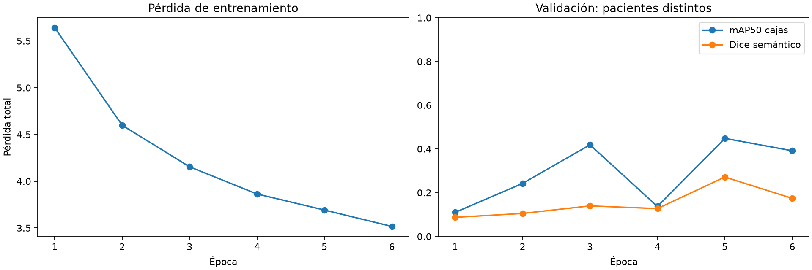
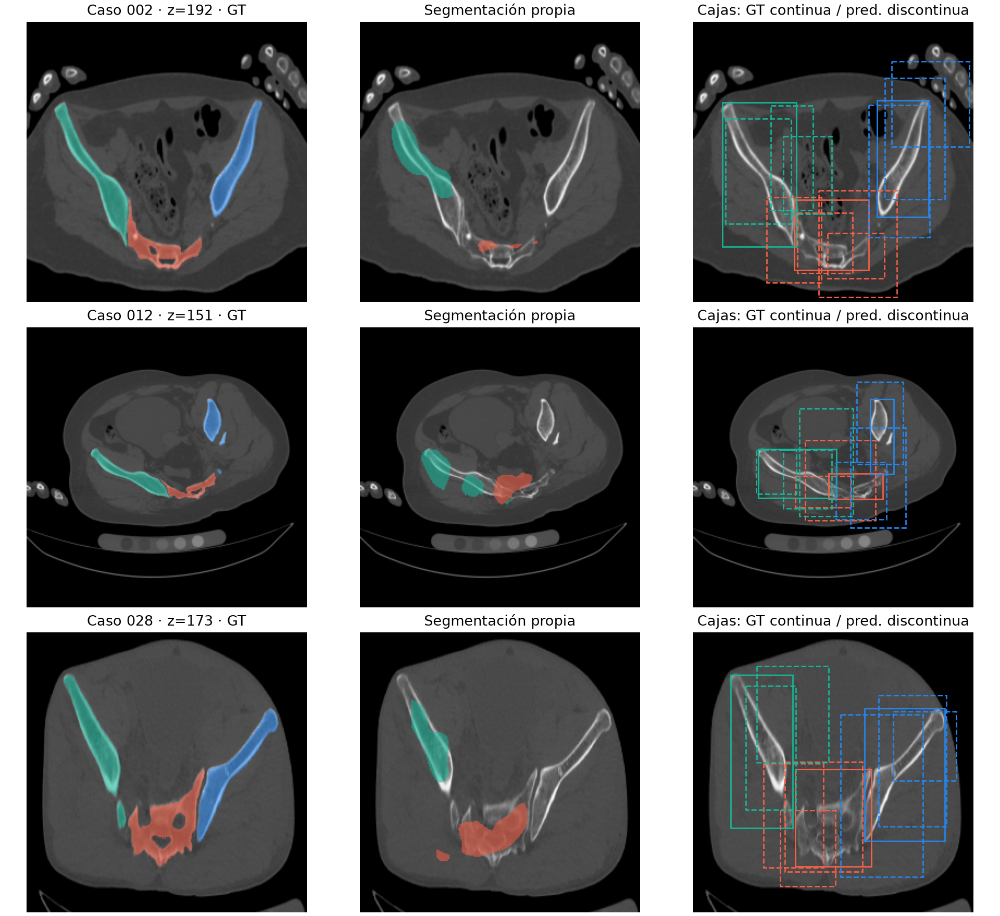
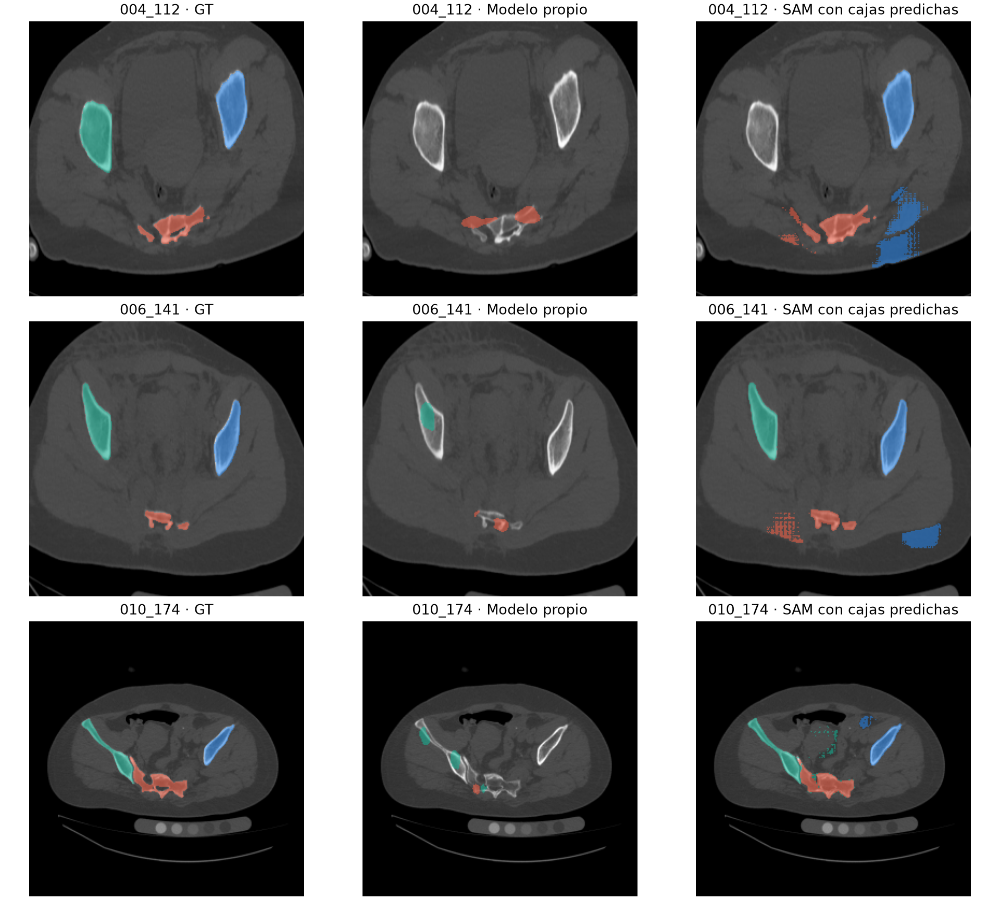

# Revisión local del proyecto PENGWIN — 8 de octubre de 2026

Se revisó y amplió la nueva versión local. Se mantuvieron el backbone FundidoraPC, CBAM espacial de 9 × 9 y el decodificador de ocho canales internos. No se consultó ni actualizó Git.

## Qué cambió y por qué

| Antes | Cambio verificado |
|---|---|
| Porcentajes supuestos de ruido | Conteo directo de las 100 máscaras: 255 de 62.738 cajas se excluirían con área < 15 (0,406 %), no 1.506. |
| Área pequeña se describía como ruido clínicamente seguro | Umbral por defecto 0. Se conservan las anotaciones; el filtro no identifica componentes ni artefactos. |
| Cuatro cortes del mismo caso para aprender y evaluar | 560 cortes de 70 pacientes train y 120 de 15 pacientes val. Test separado. |
| Máscara de tres huesos confundida con fragmentos | IDs GT conservados y cabeza auxiliar de interfaces; reconstrucción de instancias por watershed 3D. |
| Distancia 2D sacro–coxal | Distancia 3D fragmento–principal del mismo hueso, con espaciado físico y emparejamiento contra GT. |
| Rutas data/raw inexistentes en este equipo | Configuración local de los volúmenes extraídos, búsqueda recursiva y control de geometría. |
| NMS creaba tensores en CPU aunque la entrada fuera GPU | Se conserva el dispositivo. Prueba GPU pendiente: equipo disponible solo CPU. |
| Dos objetivos podían sobrescribirse en una celda | Se detecta la colisión y se informa; no se elimina silenciosamente GT. |

## Entrenamiento ejecutado

- 6 épocas, CPU, semilla 42, lote 8. Mejor checkpoint por validación: época 5.
- Ocho cortes uniformes por paciente, incluidos cortes sin hueso. Son tomografías reales: no se entrenó con imágenes sintéticas.
- Selección: media de mAP50 y Dice semántico de validación. Las máscaras quedan limitadas a cajas predichas tras NMS propio.
- Se preservó el split congelado 70/15/15. No es entrenamiento sobre todos los cortes de los 70 volúmenes.
- Pérdida media: 5.6427 → 3.5165.

| Métrica en validación | Resultado |
|---|---|
| mAP50 (cajas) | 44.82 % |
| mAP50:95 (cajas) | 13.60 % |
| IoU media por caja GT, omisiones = 0 | 51.92 % |
| F1 macro de presencia de regiones | 77.22 % |
| AUC macro de presencia | 94.81 % |
| Dice semántico macro | 27.14 % |

Dice por región: sacro 38.82 %; coxal izquierdo 0.00 %; coxal derecho 42.59 %. Un Dice cero indica una clase no segmentada correctamente; no declarar el modelo completo.

Las clases de presencia son sacro/coxal izquierdo/coxal derecho, no diagnóstico de fractura. AP usa interpolación de 101 puntos y no todos los filtros del evaluador COCO. Dice semántico no mide separación de fragmentos.

## Pérdida e instancias

Se conserva la pérdida de detección con pesos 2/5/1/1 (objetidad/caja/clase/presencia) y Focal gamma 0,5. En el experimento nuevo se promedian por separado positivos y negativos para que las celdas de fondo no dominen. Se añade 1,2 × (CE ponderada + 1,5 × Dice + 0,5 × BCE de interfaces). La CE asigna peso 0,2 al fondo y 1 a cada hueso; interfaces e interiores anotados se equilibran por separado.

Estos son pesos iniciales razonados, no una calibración comparativa terminada. Falta comparar configuraciones sobre train/val antes de declarar ese requisito cumplido. Los identificadores de fragmentos pueden cambiar entre pacientes; la pérdida de interfaces no depende de su número concreto.

La reconstrucción usa conectividad 26, umbral de borde 0,5 y volumen mínimo predicho de 20 mm³. Este mínimo afecta solamente las predicciones, nunca las anotaciones GT; no tiene validación clínica. Los bordes se aprenden en 2D y luego se apilan: no es una red volumétrica. Un borde incompleto puede unir fragmentos y un borde excesivo puede dividirlos.

## Prueba volumétrica y distancia

Caso 002 (val): 337 cortes contiguos. 6 fragmentos GT y 81 instancias predichas. Dice macro por fragmento GT, incluidas omisiones: 14.40 %. Omisiones: 3; predicciones adicionales: 78.

Parejas válidas para distancia: 0; MAE: no calculable, sin parejas válidas. Latencia media del modelo, NMS y ensamblado semántico por corte: 63.8 ms en cpu. Excluye lectura, redimensionado y watershed 3D.

GT principal: etiquetas 1/11/21. Principal predicho: instancia más voluminosa del mismo hueso. Se exige IoU ≥ 0,5 tanto para fragmento como para principal antes de comparar distancias. Las distancias se aproximan entre centros de vóxeles de superficie mediante EDT; no son distancias exactas entre caras. El contacto por vecindad 26 se informa aparte. Se ajustan espaciado y origen al redimensionar XY a 256; se mantienen todos los cortes Z. Las máscaras GT se remuestrean por vecino más cercano a esta cuadrícula; fragmentos muy pequeños pueden desaparecer, por lo que estas métricas no sustituyen una evaluación a resolución nativa.

## Comparación SAM

Evaluación congelada: 45 cortes (3 por paciente test); comparación de segmentación en 15 cortes centrales (1 por paciente). No es evaluación de todos los volúmenes test.

| Métrica en los mismos 15 cortes | Propio | SAM ViT-B zero-shot |
|---|---|---|
| Dice semántico macro | 25.95 % | 68.54 % |
| IoU semántico macro | 17.11 % | 52.98 % |
| Dice por fragmento 2D GT, incluidas omisiones | 18.08 % | 72.63 % |

Detección propia en 45 cortes: mAP50 22.01 %, mAP50:95 4.44 %. Clasificación: F1 54.81 %, AUC 93.47 %.

Instancias 2D adicionales: propio 14; SAM 244. Dice simétrico que también penaliza esas predicciones: propio 14,36 %; SAM 13,16 %. El Dice calculado solo sobre GT puede ocultar la sobresegmentación.

SAM recibió únicamente cajas del modelo, nunca cajas GT. Se conservaron omisiones y falsos positivos. La comparación 2D usa máscaras agrupadas por anatomía y componentes conectados para SAM: no constituye un segmentador de fragmentos 3D. El test ya tuvo exposición exploratoria en avances previos; no es un conjunto externo completamente virgen. No se ajustó el modelo con estos resultados.

## Qué falta para cerrar el avance 3

1. Mejorar y ampliar el entrenamiento; estudiar errores por hueso y fragmentos pequeños.
2. Calibrar pesos y posprocesamiento exclusivamente con train/val, con comparación explícita.
3. Evaluar más volúmenes completos y aumentar la cobertura de pares fragmento–principal con correspondencias fiables.
4. Presentar métricas de instancia y distancia junto con omisiones; no sustituirlas por Dice semántico.
5. Medir rendimiento GPU cuando exista equipo disponible y abordar visualizadores/dashboard del siguiente avance.

## Evidencia y reproducción

- `salidas/revision_oct08/auditoria.json` y CSV: conteos completos.
- `salidas/revision_oct08/entrenamiento/`: configuración, historial, checkpoints y predicciones de validación.
- `salidas/revision_oct08/volumenes/`: máscaras 3D, emparejamientos y distancias.
- `salidas/revision_oct08/comparacion_test/`: protocolo congelado, hashes y comparación SAM cuando se complete.
- `tests/test_revision.py`: pruebas funcionales y geométricas; registro en `salidas/revision_oct08/pruebas.txt`.
- `GUION_SUSTENTACION_SEMANA9.md`: guion corregido, Yesenia presenta primero.
- `notebooks/historico/Semana2_antes_revision.ipynb`: original preservado, con afirmaciones obsoletas. El cuaderno corregido requiere reejecución.

Consultar README para las órdenes locales. Resultados académicos preliminares; no demuestran validez clínica.
